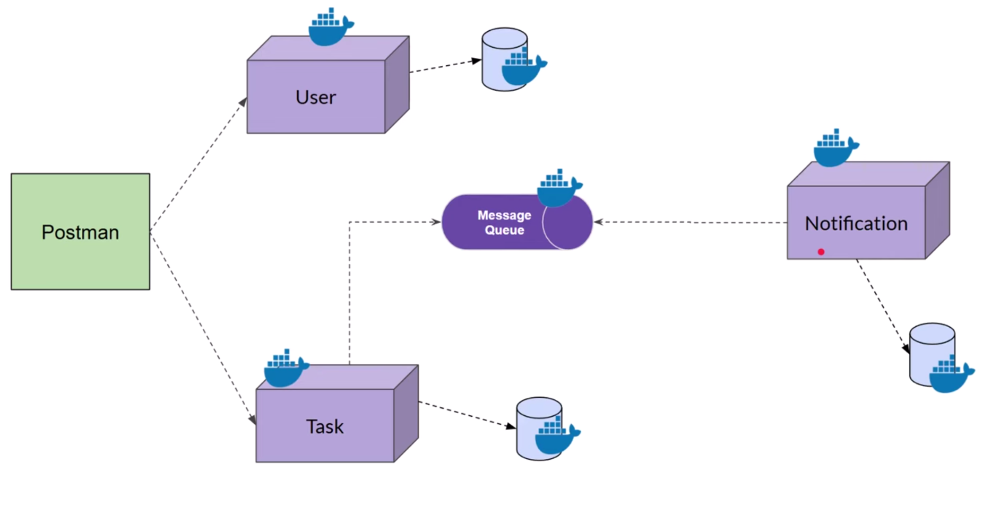

# Node.js Microservices — Task App

Node.js microservices example implementing a simple Task App using MongoDB, RabbitMQ and Docker.

## Overview

This repository contains a small set of microservices that together implement a Task management application.

- **Auth service** manages credentials and issues JWTs.
- **User service** manages user profile data.
- **Task service** manages tasks and publishes task events to RabbitMQ.
- **Notification service** consumes RabbitMQ events.

Services are containerized with Docker Compose, and can also be run locally.

## Tech Stack

- **Platform:** Node.js microservices
- **Frameworks/Libraries:** Express, Mongoose
- **Database:** MongoDB
- **Broker:** RabbitMQ
- **Containers:** Docker & Docker Compose

## Features

- User registration/login using JWT
- User profile CRUD (separate from auth data)
- Task creation and list
- Task events published to RabbitMQ (consumed by notification-service)

## Repository layout

- `auth-service/` — authentication API (JWT + users collection)
- `user-service/` — user profile API
- `task-service/` — task CRUD + RabbitMQ publisher
- `notification-service/` — RabbitMQ consumer (notifications)
- `docker-compose.yml` — orchestration for all services, MongoDB and RabbitMQ
- `readme/design.png` — architecture diagram

## Architecture



## Service Ports

- **Auth Service:** `3004`
- **User Service:** `3001`
- **Task Service:** `3002`
- **Notification Service:** `3003`
- **RabbitMQ Management UI:** `15672`
- **MongoDB:** `27017`

## Getting started (Docker Compose)

1. Ensure Docker and Docker Compose are installed.
2. From the repository root, bring up all services:

```bash
docker-compose up -d --build
```

3. Watch logs for a service (example):

```bash
docker-compose logs -f auth-service
```

## Run locally (development)

You can still use MongoDB/RabbitMQ from Docker and run a service on your machine.

Example:

```bash
cd auth-service
npm install
npm run dev
```

## Environment

At repo root there is a shared `.env` file used by Docker Compose.

### Root `.env` (used by docker-compose)

```dotenv
NODE_ENV=development
JWT_SECRET=your_secure_jwt_secret_key_here
JWT_EXPIRES_IN=1d

AUTH_SERVICE_PORT=3004
USER_SERVICE_PORT=3001
TASK_SERVICE_PORT=3002
NOTIFICATION_SERVICE_PORT=3003

MONGODB_URI=mongodb://mongo:27017/
RABBITMQ_URL=amqp://rabbitmq

AUTH_SERVICE_URL=http://localhost:3004
USER_SERVICE_URL=http://localhost:3001
TASK_SERVICE_URL=http://localhost:3002
NOTIFICATION_SERVICE_URL=http://localhost:3003
```

## Important: Container URLs vs Localhost URLs

- **Inside Docker Compose**, services should call each other via service names:
  - Example: `http://user-service:3001`
- **From your browser / Postman / curl on your machine**, use `http://localhost:<port>`.

In `docker-compose.yml`:

- `auth-service` uses `USER_SERVICE_URL=http://user-service:3001` (container-to-container).
- Some services may also have `AUTH_SERVICE_URL=http://localhost:3004` (this only works if the container can reach your host network, and is not recommended for container-to-container calls).

## Data Model (Important)

This project intentionally separates authentication data and profile data:

- **Auth DB (`auth`) → `users` collection**
  - Stores: `email`, `username`, `password (hashed)`, `role`
- **Users DB (`users`) → `userprofiles` collection**
  - Stores: `userId` (links to auth user `_id`), `name`, `email`, profile fields (`bio`, `avatar`, `preferences`)

The link is the `userId` stored in `userprofiles`.

## API Documentation

Base URLs (local):

- Auth: `http://localhost:3004`
- Users: `http://localhost:3001`
- Tasks: `http://localhost:3002`

### Auth Service (auth-service)

#### Register

`POST /api/auth/register`

Creates a new auth user and then creates a matching user profile in user-service.

Request body:

```json
{
  "name": "John Doe",
  "email": "john.doe@example.com",
  "username": "johndoe",
  "password": "SecurePassword123!"
}
```

Response `201`:

```json
{
  "user": {
    "_id": "<mongo_object_id>",
    "email": "john.doe@example.com",
    "username": "johndoe",
    "role": "user",
    "createdAt": "2025-12-30T00:00:00.000Z",
    "updatedAt": "2025-12-30T00:00:00.000Z"
  },
  "token": "<jwt>"
}
```

Notes:

- **First registered user becomes `admin`** (see auth-service logic).
- Password is never returned.

curl:

```bash
curl -X POST "http://localhost:3004/api/auth/register" \
  -H "Content-Type: application/json" \
  -d '{
    "name": "John Doe",
    "email": "john.doe@example.com",
    "username": "johndoe",
    "password": "SecurePassword123!"
  }'
```

#### Login

`POST /api/auth/login`

Request body:

```json
{
  "username": "johndoe",
  "password": "SecurePassword123!"
}
```

Notes:

- `username` field accepts **username or email**.

Response `200`:

```json
{
  "user": {
    "_id": "<mongo_object_id>",
    "email": "john.doe@example.com",
    "username": "johndoe",
    "role": "user",
    "id": "<profile_id>",
    "userId": "<mongo_object_id>",
    "name": "John Doe",
    "bio": "",
    "avatar": "",
    "preferences": {
      "theme": "light",
      "notifications": {
        "email": true,
        "push": true
      }
    },
    "createdAt": "2025-12-30T00:00:00.000Z",
    "updatedAt": "2025-12-30T00:00:00.000Z"
  },
  "token": "<jwt>"
}
```

curl:

```bash
curl -X POST "http://localhost:3004/api/auth/login" \
  -H "Content-Type: application/json" \
  -d '{
    "username": "johndoe",
    "password": "SecurePassword123!"
  }'
```

#### Get current user

`GET /api/auth/me`

Headers:

```text
Authorization: Bearer <jwt>
```

Response `200` combines auth user + user profile:

```json
{
  "_id": "<mongo_object_id>",
  "email": "john.doe@example.com",
  "username": "johndoe",
  "role": "user",
  "id": "<profile_id>",
  "userId": "<mongo_object_id>",
  "name": "John Doe",
  "bio": "",
  "avatar": "",
  "preferences": {
    "theme": "light",
    "notifications": {
      "email": true,
      "push": true
    }
  },
  "createdAt": "2025-12-30T00:00:00.000Z",
  "updatedAt": "2025-12-30T00:00:00.000Z"
}
```

curl:

```bash
curl "http://localhost:3004/api/auth/me" \
  -H "Authorization: Bearer <jwt>"
```

#### Logout

There is **no server-side logout endpoint**.

This project uses stateless JWT, so logout is handled by the client by deleting the token.

### User Service (user-service)

All user-service endpoints require:

```text
Authorization: Bearer <jwt>
```

#### Get my profile

`GET /api/users/me`

Response `200`:

```json
{
  "id": "<profile_id>",
  "userId": "<auth_user_id>",
  "name": "John Doe",
  "email": "john.doe@example.com",
  "bio": "",
  "avatar": "",
  "preferences": {
    "theme": "light",
    "notifications": {
      "email": true,
      "push": true
    }
  },
  "createdAt": "2025-12-30T00:00:00.000Z",
  "updatedAt": "2025-12-30T00:00:00.000Z"
}
```

curl:

```bash
curl "http://localhost:3001/api/users/me" \
  -H "Authorization: Bearer <jwt>"
```

#### Update my profile

`PATCH /api/users/me`

Request body (example):

```json
{
  "bio": "Senior developer",
  "preferences": {
    "theme": "dark"
  }
}
```

curl:

```bash
curl -X PATCH "http://localhost:3001/api/users/me" \
  -H "Authorization: Bearer <jwt>" \
  -H "Content-Type: application/json" \
  -d '{
    "bio": "Senior developer",
    "preferences": {"theme": "dark"}
  }'
```

#### List all users (Admin only)

`GET /api/users?page=1&limit=10`

Requirements:

- JWT must include `role: "admin"`.

Response `200`:

```json
{
  "data": [
    {
      "id": "<profile_id>",
      "userId": "<auth_user_id>",
      "name": "John Doe",
      "email": "john.doe@example.com",
      "bio": "",
      "avatar": "",
      "preferences": {
        "theme": "light",
        "notifications": {
          "email": true,
          "push": true
        }
      },
      "createdAt": "2025-12-30T00:00:00.000Z",
      "updatedAt": "2025-12-30T00:00:00.000Z"
    }
  ],
  "pagination": {
    "total": 1,
    "page": 1,
    "limit": 10,
    "totalPages": 1
  }
}
```

If you get `403 Not authorized`, log in with an admin token (first registered user is admin).

### Task Service (task-service)

Task service currently exposes simple endpoints:

#### List tasks

`GET /tasks`

curl:

```bash
curl "http://localhost:3002/tasks"
```

#### Create task

`POST /tasks`

Request body:

```json
{
  "title": "Finish report",
  "description": "Complete the quarterly report",
  "userId": "<auth_user_id>"
}
```

Notes:

- On create, a message is published to RabbitMQ queue `task_created`.

curl:

```bash
curl -X POST "http://localhost:3002/tasks" \
  -H "Content-Type: application/json" \
  -d '{
    "title": "Finish report",
    "description": "Complete the quarterly report",
    "userId": "<auth_user_id>"
  }'
```

### Notification Service (notification-service)

Notification service is intended to consume RabbitMQ messages (e.g., `task_created`).

## Common Error Responses

### 400 Validation error

```json
{
  "errors": [
    {
      "type": "field",
      "msg": "Password must be at least 8 characters",
      "path": "password",
      "location": "body"
    }
  ]
}
```

### 401 No token

```json
{
  "message": "No token provided"
}
```

### 403 Invalid token / not authorized

```json
{
  "message": "Not authorized to access this resource"
}
```

## Tests

If tests exist for a service:

```bash
cd user-service
npm test
```

## Notes & next steps

- Add rate limiting, CORS policy, and centralized logging for production.
- Consider adding refresh tokens and a token denylist if you need server-side logout.
- Consider improving inter-service communication so containers never depend on `localhost` URLs.
